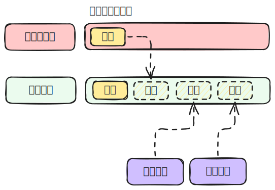

### 事件循环概念

事件循环是浏览器中的概念，发生在渲染主线程中。默认情况下，浏览器会为每个标签页开启一个独立的渲染进程，渲染进程会开启一个渲染主线程，负责 `解析HTML、解析CSS、计算样式、计算布局、处理图层、执行全局js代码、执行事件处理函数、执行定时器任务等等`，非常多的任务都需要渲染主线程来执行，如何调度这些任务成了渲染主线程的问题。

场景：当执行一个函数时，用户点击了某个按钮触发了一个事件，同时某个定时器也到达了时间，这些任务都需要渲染主线程执行，它应该怎么响应？

**thinking：**为什么渲染进程不适用多个线程来处理这么多的任务？

为了解决问题，消息队列的概念被提出。

### 事件循环过程

1. 最开始，渲染主线程会进入一个无限循环。
2. 每次循环会检查消息队列中是否有任务存在。如果有，就取出第一个任务执行，执行完一个后进入下一次循环；如果没有，就进入休眠状态。
3. 其他所有线程（包括其他进程的线程）可以随时向消息队列中添加任务。新任务会被添加到消息队列的末尾。在添加新任务时，如果渲染主线程是休眠状态，则会唤醒它并开始循环。

以上整个过程称为事件循环（消息循环）。

#### ***Question：如何理解 JS 的异步？***

JS是一门单线程的语言，这是因为它运行在浏览器的渲染主线程中，而渲染主线程只有一个。

渲染主线程承担着诸多的工作，渲染页面、执行JS都在其中运行。

如果使用同步的方式，就极有可能导致主线程产生阻塞，从而导致消息队列中的很多其他任务无法得到执行。

这样一来，一方面会导致繁忙的主线程白白的消耗时间，另一方面导致页面无法及时更新，给用户造成卡死现象。

所以浏览器采用异步的方式来避免。具体做法是当某些任务发生时，比如计时器、网络、事件监听，主线程将任务交给其他线程去处理，自身立即结束任务的执行，转而执行后续代码。当其他线程完成时，将事先传递的回调函数包装成任务，加入到消息队列的末尾排队，等待主线程调度执行。

在这种异步模式下，浏览器永不阻塞，从而最大限度的保证了单线程的流畅运行。

### 优先级

任务没有优先级，但是消息队列有优先级。消息队列不止一个，规定至少有一个微任务队列。
在目前 Chrome 中，至少存在以下队列：

- 延时队列：存放计时器相关的任务，优先级为中。
- 交互队列：存放用户操作后产生的相关任务，优先级为高。
- 微队列：存放需要最快执行的任务，优先级最高。

将任务添加到微队列的主要方式是：`Promise`、`MutationObserver`。