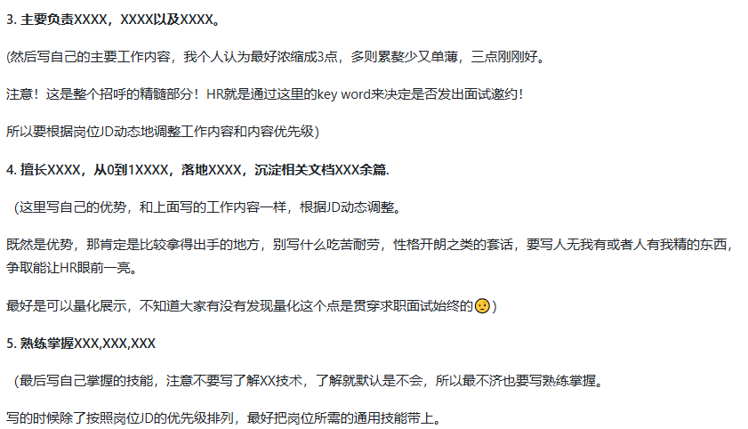

与川行网络科技(成都)有限公司  

企业安全教育培训信息系统管理，营运车辆动态监管、企业
高风险处理反馈、企业隐患自查、企业信息上报、企业信息
展示等方面建成整套服务体系，为运输行业监管部门提供源
头管理、一码管理等信息化管理手段，能有效规范企业在安
全管理中的行为。同时，赋予企业管理手段，有效提升企业
安全管理作用，共同发挥企业执行、政府监督、第三方服务
的监管体系。

该公司主要经营业务包括：企业安全教育培训、营运车辆动态监管、高风险处理反馈、隐患自查和信息上报等，
构建了一套完整的服务体系。
通过信息化手段，如源头管理和一码管理，规范企业安全管理行为。
同时，公司赋能企业，提升其安全管理效能，形成企业执行、政府监督、第三方服务协同的监管体系，助力运输行业的整体安全管理。

-----------------------------------------------------------
一定要明确项目的描述内容。
以下三个方面是我的建议:

1、一定要简单易懂的表述你这个项目是干什
么，最好体现出项目的类型

2、一定要简单说明这个项目提供给用户什
么核心功能

3、一定要尽可能总结性的说明一下项目的
难点。

项目职责，也就是项目的技术点。
一定要明确以下三个点:

1、你完成什么从技术上拿得出手的需求。
这个也可以是你平时学到的

2、你用了什么方案解决了一个什么常见与
不常见的问题

3、你在项目中封装了哪些工具、组件或者
一些功能的集成。
-----------------------------------------------------------

STAR法则是一种常用的面试回答结构，帮助面试者有条理地描述自己的经历和解决问题的能力。
STAR代表四个部分：Situation（情境）、Task（任务）、Action（行动）和Result（结果）。
具体如下：

S（Situation）情境：
描述当时的情境或背景，让面试官了解你所处的环境。
比如，你在什么样的公司、团队或项目中，遇到了什么样的挑战或问题。

T（Task）任务：
阐明你的职责或任务是什么，即在这个情境中你需要做什么。
通常，这部分是解释你在该情境下需要解决的问题或达成的目标。

A（Action）行动：
重点描述你为完成任务所采取的具体行动。
这里需要详细说明你的思路、决策过程以及具体的执行步骤，展示你的能力和解决问题的思维方式。

R（Result）结果：
说明最终的结果是什么，并量化或举例说明取得的成效。
比如，通过你的努力，项目的完成情况如何、是否达成了目标、为团队或公司带来了什么样的正面影响等。

-----------------------------------------------------------

企业端：

企业安全教育培训：为企业提供标准化的安全培训课程，提升员工安全意识。
营运车辆动态监管：实时监控企业营运车辆的运行状态，及时发现并反馈安全风险。
高风险处理反馈及隐患自查：帮助企业定期进行隐患自查，并针对高风险事件进行及时反馈和整改。
信息上报系统：企业可以通过平台快速、准确地进行安全相关信息上报。

政府端：

源头管理：政府部门通过平台可以追溯安全问题的根源，并进行相关整改措施的监督。
一码管理：通过统一的编码系统，规范企业安全管理行为，提高监管效率。

管理端：

综合监管体系：管理端作为第三方服务提供者，协同企业和政府进行安全管理工作，确保监管措施的落地与执行。

技术实现：
信息化手段：平台采用大数据和物联网技术，实现车辆实时监控和数据采集，确保高效的动态监管。
企业赋能：通过数据分析与安全管理工具，帮助企业优化安全管理流程，提升管理效能。

项目效果：
形成了企业执行、政府监督、第三方服务协同的全方位监管体系，提升了运输行业的安全管理水平。
有效减少了运输行业中的安全隐患，增强了政府对企业安全管理的监管能力，助力企业落实各项安全生产规范。

projects:
1. 交通全域数字化信息管理平台

该项目是一个以企业为单位，针对其下的营运车辆进行安全管理的一个面向企业、政府、第三方服务的信息化平台。
提供车辆、驾驶员等基本信息录入及留存的同时，还提供风险报警、重大隐患排查、资料报送、车辆实时监控等核心功能。
形成企业执行、政府监督、第三方服务协同的全方位监管体系，推动运输行业的整体安全管理。

项目职责：

该平台面向三种不同类型的用户，需要针对不同类型用户从可视内容、可操作内容进行细粒度的控制。
可视内容从路由进行拦截，根据是否具有相应权限选择放行、重定向等操作。
可操作内容一般是一些按钮，可以封装权限守卫组件，在Vue中还可以选择自定义指令如 v-permission 来控制。

实时监控：
参与物联感知模块下的实时监控开发，用于业务场景中的车辆地理位置及车辆状态等信息的展示与交互。

amap-jsapi

实时监控模块需要实现对车辆定位打点的功能，点击车辆显示相关信息，如果同时选中上千辆车会造成卡顿的问题。

在地图网格上对多个距离相近的车辆进行聚合，大幅减少地图上的定位点数量，提高地图渲染性能。

由于项目中对地图功能的需求比较多，所以封装成组件降低需要使用地图进行相关业务开发时的复杂度。

对定位、地图缩放、地图图层等基本需求进行功能组件或接口的封装，可根据业务需求使用。

封装高度可复用的hooks，将地图插件和相关工具与vue自身的功能特性相结合，内聚状态逻辑，提升代码可维护性的同时，降低开发的难度。
如:
useMarkerClusterer: 对多个定位点进行聚合显示，对于需要在地图网格上渲染大量定位点来说，可以使用该hook，提高地图渲染性能。

useControlBar: 集成地图旋转、倾斜、复位操作的控件，用于需要使用3D地图并进行旋转等操作的场景。

useMouseTool: 集成鼠标工具，用于使用鼠标绘制标记点、线段、圆形、矩形、多边形等覆盖物的场景。

useRenderOverlays: 集成渲染覆盖物，用于在地图上渲染不同类型覆盖物的场景。

2. 动态监管平台

-----------------------------------------------------------
"动态监管平台" 是一个用于实时监管车辆动态数据的系统，
主要功能包括通过表格形式展示各种关键数据，如车辆位置、运行状态、企业合规信息等。
平台旨在提高物流监管的透明度和效率，为管理者提供实时数据支撑，助力更好地进行决策分析。
系统通过数据采集、分析和展示，为用户提供了多维度的数据视图。
-----------------------------------------------------------

该项目主要面向第三方服务人员，对车辆、企业进行信息录入

该平台是一个用于动态监管企业营运车辆数据的系统，
主要功能包括通过表格形式展示车辆原始定位数据、疲劳驾驶、道路等级限速、车辆里程汇总、证据中心等各种关键数据。
为用户提供高效的数据处理能力。

项目职责：

基于 Ant Design Table 组件进行了深度封装，
集成了数据接口请求后的逻辑处理，开发者只需专注于处理返回数据。
筛选功能同样支持高度可扩展，屏蔽了常见筛选类型和逻辑，
实现了简单配置即可完成复杂筛选操作的效果，提高了30% 左右的业务开发效率。

支持用户自由定制数据列的显示，结合持久化存储记住用户自定义配置等操作记录，提高使用的灵活性。

基于XLSX封装批量导入、导出功能，解决用户面临大量信息录入效率低下的问题，提升了他们 50% 左右的工作效率。

3. 大屏

交通运输全域智慧化日常管理服务平台

-----------------------------------------------------------
该项目是一个以车辆监管为主题的大屏数据可视化系统，旨在对危重车辆的运行情况进行监控与分析。
平台提供了数据分析、实时监控、同步展示出现安全报警车辆及处理情况，
统计各时间段不同类型的车辆报警，得到发生次数较高的报警类型，
根据车辆运行数据生成安全周报，展示平台应用成果

帮助用户更直观、全面地了解和管理危重车辆的运行情况，降低安全事故的发生率。
通过该平台，管理者可以实时接收安全事件的预警，统计报警数据，生成安全周报，展示平台应用成效。项目还提供实时的车辆分布和平台企业分布情况，
提升安全监管的效率与准确性。
-----------------------------------------------------------

危重车辆实时动态监管平台

该项目是一款大屏数据可视化系统，
旨在对危重车辆的运行状况进行实时监控和分析。
平台提供车辆分布监控、报警同步展示、报警类型统计和分析，并生成车辆运行的安全周报，
帮助管理者高效监控和管理车辆安全情况。

项目职责：

基于 Echarts 构建大屏展示系统，生成各类报警的趋势报告和安全周报，辅助管理员进行安全评估与决策。
提供直观的车辆实时分布和报警情况可视化，

使用状态管理库实现一套数据驱动多个层级组件视图更新，避免数据流的混乱。

基于 vue3-seamless-scroll 实现无限列表滚动功能

4. 小程序

交务云

该小程序是用于对“交通全域数字化信息管理平台”引流的微应用，
旨在通过移动端提供平台的高频核心功能，打破时间和地点的限制。
主要功能涵盖事故报送、一键报警、企业诉求、会议管理等。

项目职责：

基于 uniapp 的 canvas 组件实现电子签名功能。

基于 uniapp 的 scroll-view 组件封装列表懒加载组件，实现列表无限滚动加载，提升响应速度。

封装文件资源组件，支持txt、image、video等文件的展示。

处理设备差异问题，如 uni.openDocument api 可以打开的文件类型有 pdf, docx, xlsx, pptx，
  在 android 设备上使用该 api 可以唤醒对 zip等格式的压缩包文件操作，
  但在 ios 设备没有任何反应，
  所以基于 jszip 实现了对 zip 压缩包的解压和对其中文件的预览功能。 

对于 ios 设备同样还需要处理底部安全区域的问题

---------------------------------------------------------

以上职责去看一下具体实现，构思描述

简历生成参考：
https://www.laoyujianli.com

如何跟 HR 打招呼：
https://www.laoyujianli.com/passage/1701477169135759361

您好，我对您发布的 <u>前端开发</u> 岗位很感兴趣。
本人具有 <u>x</u> 年相关的工作经验，上一段工作经历是在
<u>与川行网络科技（成都）有限公司</u> 担任 <u>前端开发工程师</u>。

主要负责 <u>道路运输相关系统的前端部分开发，...，...，</u>。
量化
熟练使用 <u>Vue3、React、TypeScript等技术进行实战开发</u>，
详细情况您可以看下我的简历，期待您的回复！

可以询问的问题：
公司的绩效考核是怎样的？

如何清肝火，健脾祛湿化痰？

