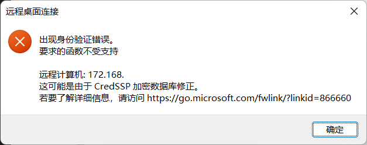

## 错误截图

## 解决方法

1. win + r 打开运行窗口
2. 输入 regedit 打开注册表编辑器
3. 找到路径 HKEY_LOCAL_MACHINE\SOFTWARE\Microsoft\Windows\CurrentVersion\Policies\System
4. 在 System 文件夹下新建 CredSSP 文件夹
5. 在 CredSSP 文件夹下新建 Parameters 文件夹
   1. 在 Parameters 文件夹下新建 DWORD (32位) 值
   2. 命名为 AllowEncryptionOracle
   3. 将值设为 2, 基数选择 16进制
   4. 点击确定
6. 现在可以远程连接了